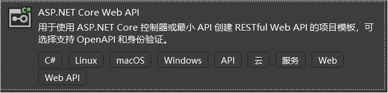
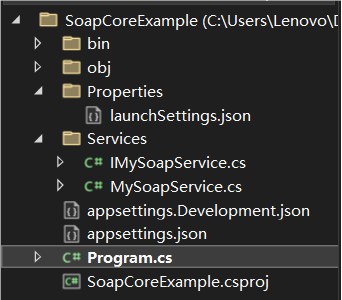
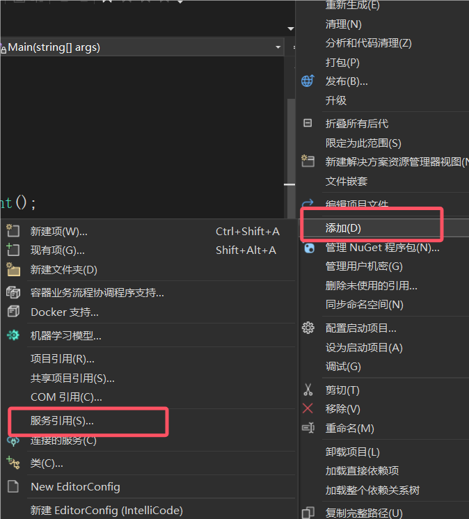
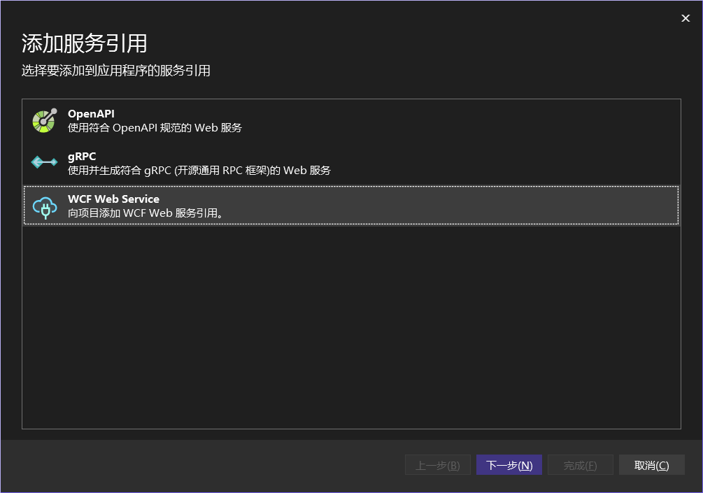
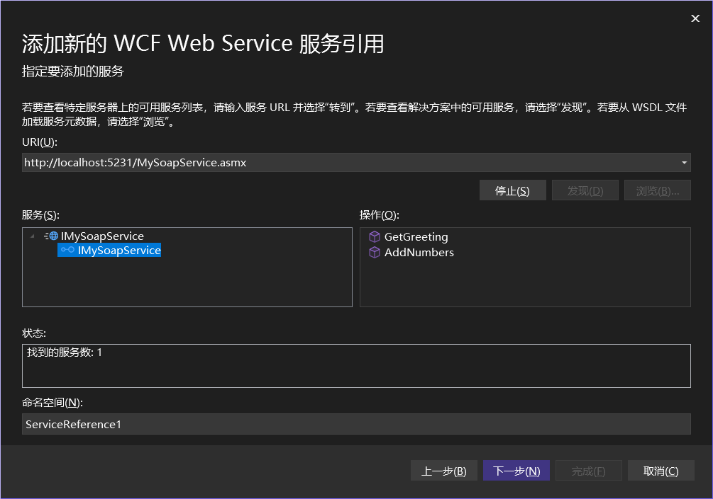
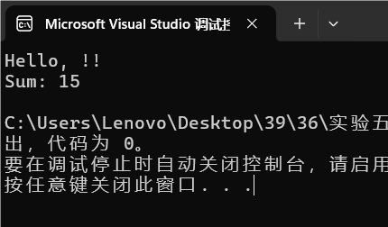
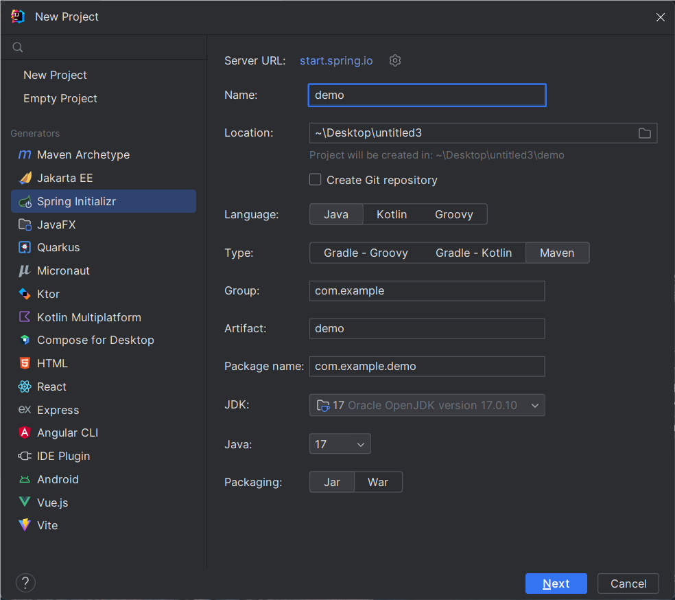
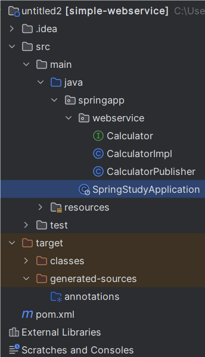
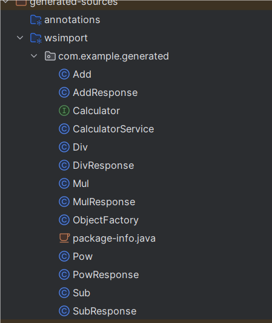
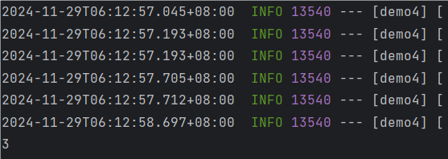

# Web-Service-Tutorial
## 基于SOAP的服务开发
- .NET 版本
  - 项目创建
  
    - 框架：Visual Studio 2022
  
    - 模板：ASP.NET Core Web API
  
    - 创建方式：
  
      ​	1.创建新文件夹后，在新文件夹目录下使用指令
  
      ```bash
      dotnet new web -n SoapWebService
      ```
  
      ​	2.直接在Visual Studio 2022中选择ASP.NET Core Web API模板
  
      
  
    - 添加依赖库(SoapCore):
  
      ​	方式：在项目目录使用指令
  
      ```bash
      dotnet add package SoapCore
      ```
  
      > 由于 ASP.NET Core 本身并不原生支持 SOAP，通常通过第三方库如 SoapCore 来实现 SOAP 服务
  
    - 整体项目目录
  
      
  
  - 服务实现
  
    - 设计接口：
  
      设计任何你想做的接口，本项目举例设计打招呼和加法接口
  
      ```c#
      [ServiceContract(Namespace = "http://localhost:5231")]
      public interface IMySoapService
      {
          [OperationContract]
          string GetGreeting(string name);
      
          [OperationContract]
          int AddNumbers(int a, int b);
      }
      ```
  
      > `Namespace`是一个标识符，在连接时会需要用到,本项目中了解即可，在连接时会自动配置
  
    - 实现接口：
  
      实现打招呼和加法接口
  
      ```c#
      public class MySoapService : IMySoapService
      {
          public string GetGreeting(string name)
          {
              return $"Hello, {name}!";
          }
      
          public int AddNumbers(int a, int b)
          {
              return a + b;
          }
      }
      ```
  
      > GetGreeting为打招呼方法，AddNumbers为加法方法
  
    - 发布Soap服务：
  
      下面是发布服务的基础模板
  
      ```c#
      var builder = WebApplication.CreateBuilder(args);
      
      // 注册 SOAP 服务
      builder.Services.AddSoapCore();
      builder.Services.AddSingleton<IMySoapService, MySoapService>();
      
      var app = builder.Build();
      
      // 配置 SOAP 端点
      app.UseRouting();
      app.UseSoapEndpoint<IMySoapService>(
          "/MySoapService.asmx",
          new SoapCore.SoapEncoderOptions()
      );
      
      app.Run();
      ```
  
      > /MySoapService.asmx可以改为任何你想要的地址，在调用时需要使用的后缀
  
    - 尝试服务访问
  
      - 修改默认地址
  
         在配置文件Porperties/lauchSettings.json中，有默认地址信息，可以修改
  
        ```json
        "http": {
          "commandName": "Project",
          "dotnetRunMessages": true,
          "launchBrowser": true,
          "applicationUrl": "http://localhost:5231",
          "environmentVariables": {
            "ASPNETCORE_ENVIRONMENT": "Development"
          }
        }
        ```
  
      - 启动项目
  
        在项目文件夹目录下使用指令
  
        ```bash
        dotnet run
        ```
  
      - 尝试访问
  
        http://localhost:5231/MySoapService.asmx
  
  - 本地服务调用
  
    ​	使用Visual Studio 2022创建一个C#空项目，右击项目目录文件夹->添加->服务引用
  
    
  
    ​	选择WCF Web Service
  
    
  
    ​	输入URLhttp://localhost:5231/MySoapService.asmx
  
    
  
    > 可以自己为"命名空间"命名,本项目的命名空间为MySoapService
  
    ​	完成后即可直接用代码访问
  
    ```c#
    static  void Main(string[] args)
    {
        // 创建服务的客户端实例
        MySoapServiceClient client = new MySoapServiceClient();
    
        string soap = client.GetGreeting("!");
        // 调用服务方法
        Console.WriteLine(soap);
        Console.WriteLine($"Sum: {client.AddNumbers(5, 10)}");
    
        client.Close();
    }
    ```
  
    ​	运行结果
  
    
  
    
  
- JAVA 版本
  - 项目创建
  
    - 框架：IntelliJ IDEA 2023.2
  
    - 模板：SpringBoot(Maven)
  
    - 创建方式：
  
      创建一个SpringBoot Maven项目
  
      
  
    - 添加依赖
  
      在pom.xml中加入
  
      ```xml
      <dependency>
          <groupId>org.apache.cxf</groupId>
          <artifactId>cxf-rt-frontend-jaxws</artifactId>
          <version>3.4.5</version>
      </dependency>
      <dependency>
          <groupId>org.apache.cxf</groupId>
          <artifactId>cxf-rt-transports-http</artifactId>
          <version>3.4.5</version>
      </dependency>
      <dependency>
          <groupId>org.apache.cxf</groupId>
          <artifactId>cxf-rt-transports-http-jetty</artifactId>
          <version>3.4.5</version>
      </dependency>
      <!-- JAX-WS annotation dependency -->
      <dependency>
          <groupId>javax.jws</groupId>
          <artifactId>javax.jws-api</artifactId>
          <version>1.1</version>
      </dependency>
      <!-- 添加Spring Boot Starter Web依赖 -->
      <dependency>
          <groupId>org.springframework.boot</groupId>
          <artifactId>spring-boot-starter-web</artifactId>
      </dependency>
      <!-- 添加Spring Boot Starter CXF依赖 -->
      <dependency>
          <groupId>org.apache.cxf</groupId>
          <artifactId>cxf-spring-boot-starter-jaxws</artifactId>
          <version>3.4.5</version>
      </dependency>
      ```
  
    - 项目整体目录
  
      
  
  - 服务实现
  
    - 设计接口
  
      设计任何你想做的接口，本项目举例设计加减乘除和乘方
  
      ```java
      @WebService
      public interface Calculator {
          @WebMethod
          int add(int a, int b);
      }
      ```
  
    - 实现接口
  
      ```java
      @WebService
      public class CalculatorImpl implements Calculator {
          @Override
          public int add(int a, int b) {
              return a + b;
          }
      }
      ```
  
      > add为加法
  
    - 发布服务
  
      ```java
      public class CalculatorPublisher {
          public static void main(String[] args) {
              // 创建服务对象
              Calculator calculator = new CalculatorImpl();
              // 创建服务器工厂
              JaxWsServerFactoryBean factory = new JaxWsServerFactoryBean();
              factory.setServiceClass(Calculator.class);
              factory.setAddress("http://localhost:7070/calculator?wsdl");
              factory.setServiceBean(calculator);
              // 设置QName
              factory.setServiceName(new QName("http://webservice.example.com/", "CalculatorService"));
              factory.setEndpointName(new QName("http://webservice.example.com/", "CalculatorPort"));
              // 发布服务
              factory.create();
              System.out.println("---------------------------------------------------------------------------");
              System.out.println("Calculator service is running at http://localhost:7070/calculator?wsdl");
              System.out.println("---------------------------------------------------------------------------");
          }
      }
      ```
  
      > 注：Springboot会默认将主执行类运行到电脑的8080端口上，这里我们直接在`CalculatorPublisher`中写一个运行类，启动这个类就可以执行在我们想要的7070端口上
  
    - 尝试服务访问
  
      - 启动项目
  
        启动`CalculatorPublisher`类
  
      - 尝试访问
  
        http://localhost:7070/calculator?wsdl
  
  - 本地服务调用
  
    - 创建一个SpringBoot Maven项目
  
    - 添加依赖
  
      在pom.xml中加入
  
      ```xml
      <dependency>
          <groupId>org.glassfish.jaxb</groupId>
          <artifactId>jaxb-runtime</artifactId>
          <version>2.3.1</version>
      </dependency>
      <!-- Spring Web Services -->
      <dependency>
          <groupId>org.springframework.ws</groupId>
          <artifactId>spring-ws-core</artifactId>
          <version>4.0.0</version>
      </dependency>
      <!-- JAX-WS 实现（选择一个实现，如 Apache CXF 或 JAX-WS RI） -->
      <dependency>
          <groupId>org.apache.cxf</groupId>
          <artifactId>cxf-rt-frontend-jaxws</artifactId>
          <version>3.5.3</version>  <!-- 或其他合适版本 -->
      </dependency>
      <dependency>
          <groupId>org.apache.cxf</groupId>
          <artifactId>cxf-rt-transports-http</artifactId>
          <version>3.5.3</version> <!-- 或你使用的版本 -->
      </dependency>
      <!-- JAX-WS -->
      <dependency>
          <groupId>javax.xml.ws</groupId>
          <artifactId>jaxws-api</artifactId>
          <version>2.3.1</version>
      </dependency>
      <!-- Spring Web Services Client -->
      <dependency>
          <groupId>org.springframework.ws</groupId>
          <artifactId>spring-ws-support</artifactId>
          <version>4.0.0</version>
      </dependency>
      
      
      <!-- 这个是插件，放在build-plugins下 -->
      <plugin>
      	<groupId>org.codehaus.mojo</groupId>
      	<artifactId>jaxws-maven-plugin</artifactId>
      	<version>2.6</version> 
      	<executions>
      		<execution>
      			<goals>
      				<goal>wsimport</goal>
      			</goals>
      			<configuration>
      				<wsdlUrls>
      					<wsdlUrl>http://localhost:7070/calculator?wsdl</wsdlUrl>
      				</wsdlUrls>
      <packageName>com.example.generated</packageName> 
      			</configuration>
      		</execution>
      	</executions>
      </plugin>
      ```
  
    - 自动生成模板类
  
      在项目目录终端使用指令
  
      ```bash
      mvn clean generate-sources
      ```
  
      可以自动生成已发布soap web服务的service实现类
  
      
  
    - 直接调用
  
      ```java
      //SoapClientService.java
      public class SoapClientService {
          public int callSoapService(int num1, int num2) {
              try {
                  // 1. 定义 WSDL 的 URL
                  URL wsdlURL = new URL("http://localhost:7070/calculator?wsdl"); // Web 服务的 WSDL 地址
                  // 2. 创建 Web 服务的实现类
                  CalculatorService service = new CalculatorService(wsdlURL);
                  // 3. 获取 Web 服务端口
                  Calculator port = service.getCalculatorPort();
                  // 4. 调用 Web 服务方法
                  return port.add(num1, num2);
              } catch (Exception e) {
                  e.printStackTrace();
                  return -1;  // 错误处理
              }
          }
      }
      //Demo4Application.java
      public static void main(String[] args) {
      		SpringApplication.run(Demo4Application.class, args);
      		SoapClientService client = new SoapClientService();
      		int result = client.callSoapService(1,2);
      		System.out.println(result);
      	}
      ```
  
    - 输出结果
  
      
  
- 网络服务调用
  - .NET 版
  
    原理：通过http协议使用post方式向soap服务发送请求，直接获得请求结果并进行结果处理
  
    ```c#
    public class SoapWeb : MonoBehaviour
    {
        private string mobileCodeServiceUrl = "http://www.webxml.com.cn/WebServices/MobileCodeWS.asmx";
        public void GetmobileCodeInfo(GameObject output)
    	{
        	StartCoroutine(CallWebServices.CallWebService(
        	    mobileCodeServiceUrl,
        	    "/getMobileCodeInfo",
        	    "http://WebXml.com.cn/getMobileCodeInfo",
        	    new KeyValuePair<string, string>[]
        	    {
        	        new KeyValuePair<string, string>("mobileCode", mobileCode.text),
        	        new KeyValuePair<string, string>("userID", "")
        	    },
        	    ResultFomat.ParseMobileCodeResponse,
        	    output
        	));
    	}
    }
    ```
  
    生成 WWWForm 对象
  
    ```c#
    public static class WWWFormUtility
    {
        /// <summary>
        /// 根据键值对数组生成 WWWForm 对象
        /// </summary>
        /// <param name="keyValuePairs">键值对数组</param>
        /// <returns>生成的 WWWForm 对象</returns>
        public static WWWForm GenerateForm(KeyValuePair<string, string>[] keyValuePairs)
        {
            WWWForm form = new WWWForm();
    
            if (keyValuePairs!=null)
            {
                foreach (var pair in keyValuePairs)
                {
                    form.AddField(pair.Key, pair.Value); // 添加键值对到表单
                }
                return form;
            }
            else
                return form;
        }
    }
    ```
  
    Web 服务调用
  
    ```c#
    public  class CallWebServices 
    {
        /// <summary>
        /// 通用 Web 服务调用方法
        /// </summary>
        /// <param name="serviceUrl">服务基础 URL</param>
        /// <param name="endpoint">接口路径</param>
        /// <param name="soapAction">SOAPAction 请求头</param>
        /// <param name="keyValuePairs">表单参数</param>
        /// <param name="parseFunction">解析函数</param>
        /// <returns>IEnumerator 用于协程调用</returns>
        public static IEnumerator CallWebService(string serviceUrl, string endpoint, string soapAction, KeyValuePair<string, string>[] keyValuePairs, System.Func<string,GameObject , string> parseFunction,GameObject output)
        {
            WWWForm form = WWWFormUtility.GenerateForm(keyValuePairs);
    
            // 创建并配置请求
            UnityWebRequest request = CreateWebRequest(serviceUrl + endpoint, form, soapAction);
    
            // 发送请求
            yield return request.SendWebRequest();
    
            // 检查结果
            if (request.result == UnityWebRequest.Result.ConnectionError || request.result == UnityWebRequest.Result.ProtocolError)
            {
                Debug.LogError($"Request failed ({endpoint}): {request.error}");
            }
            else
            {
                string response = request.downloadHandler.text;
                // 调用解析函数处理响应
                string parsedResult = parseFunction(response,output);
            }
        }
    
        /// <summary>
        /// 创建并配置 UnityWebRequest
        /// </summary>
        /// <param name="url">请求 URL</param>
        /// <param name="form">请求表单</param>
        /// <param name="soapAction">SOAPAction 请求头</param>
        /// <returns>配置后的 UnityWebRequest</returns>
        public static UnityWebRequest CreateWebRequest(string url, WWWForm form, string soapAction)
        {
            UnityWebRequest request = UnityWebRequest.Post(url, form);
            request.SetRequestHeader("Content-Type", "application/x-www-form-urlencoded");
            request.SetRequestHeader("SOAPAction", soapAction);
            return request;
        }
    }
    ```
  
    结果解析
  
    ```c#
    /// <summary>
    /// 解析 getMobileCodeInfo 响应
    /// </summary>
    public static string ParseMobileCodeResponse(string xml, GameObject output)
    {
        try
        {
            XmlDocument xmlDoc = new XmlDocument();
            xmlDoc.LoadXml(xml);
    
            XmlNamespaceManager nsManager = new XmlNamespaceManager(xmlDoc.NameTable);
            nsManager.AddNamespace("web", "http://WebXml.com.cn/");
    
            XmlNode stringNode = xmlDoc.SelectSingleNode("//web:string", nsManager);
            if (stringNode != null)
            {
                string[] parts = stringNode.InnerText.Split('：');
                if (parts.Length == 2)
                {
                    output.GetComponent<TMP_Text>().text = stringNode.InnerText;
                    return $"手机号码：{parts[0]}\n详细信息：{parts[1]}";
                }
                return $"无法解析内容：{stringNode.InnerText}";
            }
            return "解析失败，未找到带命名空间的 <string> 节点";
        }
        catch (Exception ex)
        {
            Debug.LogError("Error parsing response: " + ex.Message);
            return "解析失败";
        }
    }
    ```
  
    > 本项目是在Unity的基础上建立的只需要将传入参数`GameObject output`赋值一个可展示的组件上即可运行
  
  - JAVA 版

## 基于REST的服务开发
- REST四种基本方法：

  

- 项目创建
  
    - 框架：Visual Studio 2022
  
    - 模板：ASP.NET Core Web API
  
    - 创建方式：
        直接在Visual Studio 2022中选择ASP.NET Core Web 应用模板
      
        
    - 整体项目目录
      
        
    
- 服务实现
  - 设计API
    
    设计想要设计的API，本项目举例设计一个计算器API，里面使用的是REST四种方法之一的GET方法
    
     

     
  - 服务部署
    
    发布API
    
    

    该API的默认地址：https://localhost:7166

    

  - 界面开发
   
    界面这里使用的是HTML网页
    - HTML网页代码如下：

    

    -呈现的效果如下：

    

  - 服务调用
    - 本地调用
      
      先确保本地API服务运行，再到浏览器或者使用Postman测试
      1.浏览器：
      
      

      2.Postman：
 
      

    - 网页调用

      - 上传HTML网页到GitHub上，操作如下：
      
        1.在GitHub上创建一个新的仓库

        

        2.将HTML文件推送到仓库中

        

        3.在仓库的setting中启用GitHub Pages将其设置为从main分支中提供文件：

        

        4.HTML网页将通过GitHub Pages提供服务，这里的URL为：

        

      - 将API部署到服务器

          1.部署到传统服务器，列如：Apache、Nginx等web服务器

          2.部署到云服务，列如：AWS、Azure、Google Cloud、Heroku、Vercel等平台

          部署后有一个公网可以访问的URL，将这个URL替换到HTML中的API调用地址，即可实现网页调用

## Web服务组合

## Web服务测试
